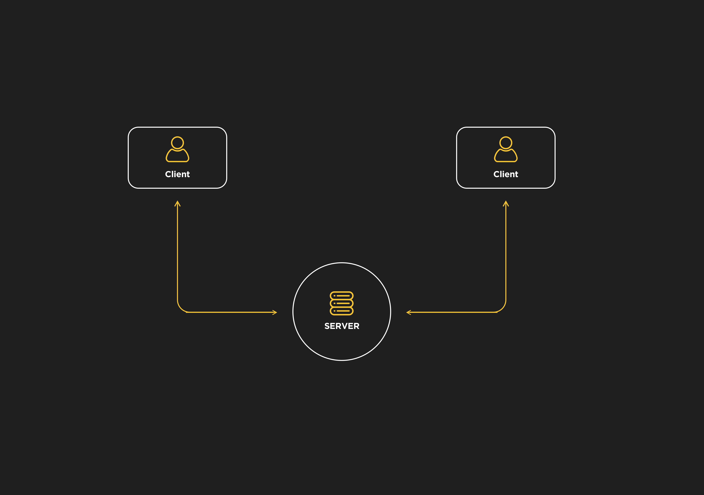
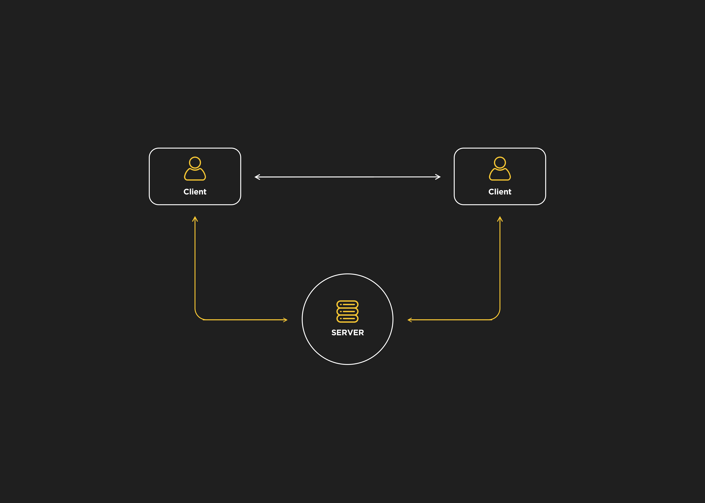
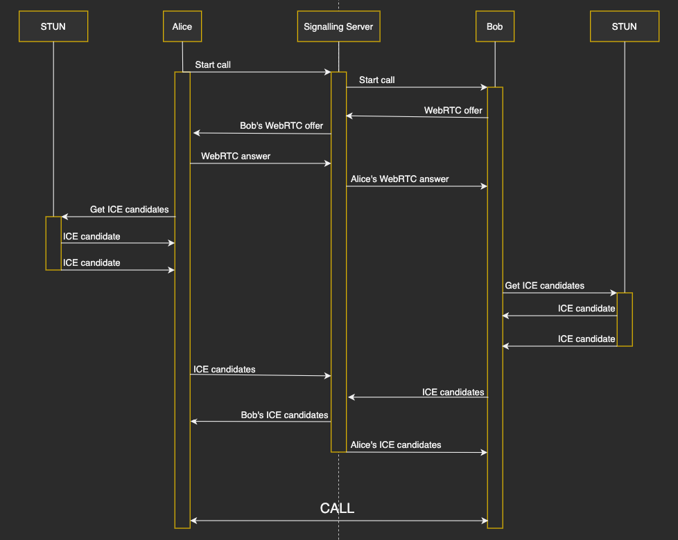
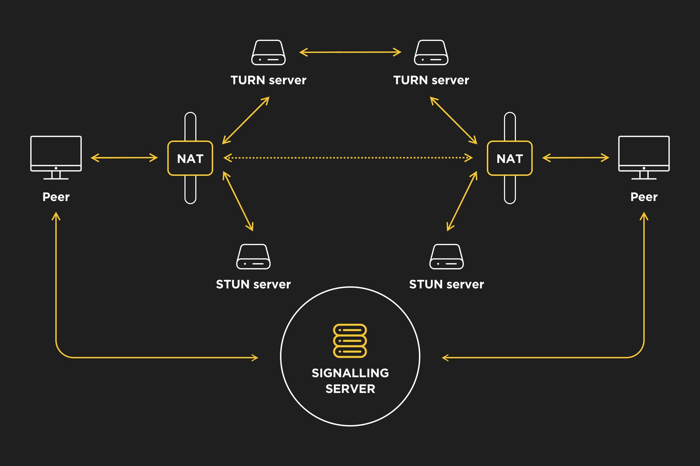

[WebRTC introduction](#webrtc-introduction)

[WebRTC APIs](#webrtc-apis)

## WebRTC introduction

WebRTC (Web Real Time Communication) is an open source project that enables peer-to-peer communication between browsers. In other words, WebRTC allows you to exchange any kind of media through the web (such as video, audio and data) without any required plugin or framework.

Direct communication between browsers improves performance and reduces latency times since clients don’t need to keep sending and receiving messages through a server. For instance, we could use [WebSockets](https://www.html5rocks.com/en/tutorials/websockets/basics/) to connect two clients but a server would have to route their messages as in the next diagram:

By contrast, WebRTC only needs a server to establish and control clients’ connections. This process is known as signalling. Once the browsers have collected the required information of the peers, they can communicate with each other:

WebRTC doesn’t specify the signalling messaging protocol so the chosen implementation has to be based on the application requirements, some of the most common approaches are: WebSockets, SIP, XHR, XMPP, etc.

The signalling process works as follows:

- A client initiates the call.

- The caller creates an _offer_ using the [Session Description Protocol](https://en.wikipedia.org/wiki/Session_Description_Protocol) (SDP) and sends it to the other peer (callee).

- The callee responds to the offer with an _answer_ message containing an SDP description too.

- Once both peers have set their local and remote session descriptions, which include information such as browser’s codecs and metadata, they know the media capabilities used for the call. However, they won’t be able to connect and exchange their media data yet because SDPs are not aware of things like external [NATs](https://en.wikipedia.org/wiki/Network_address_translation) (Network Address Translators), IP addresses and how to handle any port restrictions. This is achieved by [Interactive Connectivity Establishment](https://en.wikipedia.org/wiki/Interactive_Connectivity_Establishment) (ICE).

So how does Interactive Connectivity Establishment work? ICE is a peer-to-peer network communication method to send and receive media information over the Internet. How routing is made (NATs, firewalls …) is out of the scope of this article but it’s something that WebRTC needs to deal with. ICE gathers available network connections, known as _ICE candidates_, and uses protocols [STUN](https://en.wikipedia.org/wiki/STUN) (Session Traversal Utilities for NAT) and [TURN](https://en.wikipedia.org/wiki/Traversal_Using_Relays_around_NAT) (Traversal Using Relays around NAT) for NAT and firewall traversal.

This is how ICE handles the connection:

- First, it tries to connect peers directly via UDP.

- If UDP fails, it tries TCP.

- If both UDP and TCP direct connection fail, which is often the case in real scenarios because of NATs and firewalls, ICE will first use a STUN server with UDP to connect peers. A STUN server is a server that implements the STUN protocol and is used to find the public address and port of a peer behind an asymmetric NAT.

- If the STUN server fails, ICE will use a TURN server, which is a STUN server with some extra relaying functionalities that can traverse symmetric NATs.

As you can see, ICE tries to use STUN servers first but TURN relay servers will be needed for very restrictive corporate networks. TURN relay servers are expensive, you will need to pay for your own ones or use a service provider, however, most of the time ICE will be able to connect peers with STUN. The following schema shows a STUN/TURN communication:

To summarise, the signalling process is used to exchange media information with SDP files and ICE is used to exchange the network connection of the peers. After the communication has been set up, peers can finally exchange data directly through their browsers.

Regarding security, WebRTC includes some mandatory features to cope with different risks:

- Media streams are encrypted using Secure Real-time Transport Protocol ([SRTP](https://en.wikipedia.org/wiki/Secure_Real-time_Transport_Protocol)) and data streams are encrypted using Datagram Transport Layer Security ([DTLS](https://en.wikipedia.org/wiki/Datagram_Transport_Layer_Security)).

- Access to camera and microphone has to be granted by the client. To keep the client aware, browsers show icons if the device’s camera or microphone is active.

- All WebRTC components run in the [browser sandbox](https://web.dev/browser-sandbox/) and use encryption, they don’t need any kind of installation, they will just work as long as the browser supports them.

## WebRTC APIs

WebRTC relies on three main JavaScript APIs:

- [MediaStream](https://developer.mozilla.org/en-US/docs/Web/API/MediaStream) (_aka getUserMedia_): this interface represents a device’s media stream that can include audio and video tracks. The [_MediaDevies.getUserMedia()_](https://developer.mozilla.org/en-US/docs/Web/API/MediaDevices/getUserMedia) method retrieves a MediaStream (for instance, it can be used to access a phone’s camera).

- [RTCPeerConnection](https://developer.mozilla.org/en-US/docs/Web/API/RTCPeerConnection): it allows the communication between peers. Streams accessed by MediaDevices.getUserMedia() are added to this component, which also handles the SDP offer and answer messages exchanged between peers and ICE candidates.

- [RTCDataChannel](https://developer.mozilla.org/en-US/docs/Web/API/RTCDataChannel): it enables real time communication of arbitrary data. It’s often compared to WebSockets although it connects browsers to exchange data directly. As explained previously, direct communication between browsers improves performance so this API can be used for some interesting applications like gaming or encrypted file sharing.